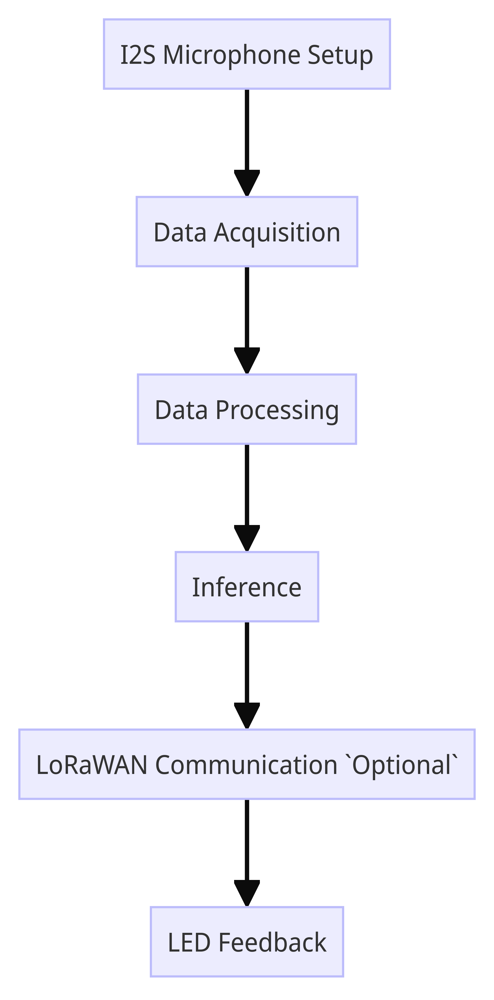

# Bird songs identification
* BERDNYK Mariia
## Description
**Context**: 
Our project aims to identify bird songs from test files using a STM32L476RGT6 Microcontroller board. 
For the project we selected these birds species:


**Goals**: 
The project aimed to efficiently identify bird calls in multiple test files using a microphone for real-time recognition while playing back sound recordings, then display the results in the serial monitor console. We built our database by retrieving records using the Xeno-canto site API presented during the course to achieve this objective.

**Environment of test**:
The reconnaissance aimed to run on a STM32L476RGT6 Microcontroller board which has a low
amount of RAM and storage. 
This MCU is based on the ARM Cortex M4 architecture and runs at a frequency of 80 MHz. The
board provides 1 MB Flash and 128 KB SRAM. 
It is therefore necessary to build not only an efficient network, but
especially a low-power network in order to be able to deploy it on the ultra-low power card.

## Workflow

We began with **Data Download**. To achieve this, we utilized the ``xenocanto`` Python library, as well as species outlined in the ``S11 Project Edge AI`` lecture. However, due to insufficient audio data, we had to substitute several species.

The 2nd step involved **Data Conversion**. Initially, the raw data obtained from the xenocanto library was in *.mp3* format. However, for model training, *.wav* files were required. To address this, we used the ``soundfile`` library together with ``librosa`` to load and convert the data files into the *.wav* format.

The 3rd step is **Removing of silent parts and truncation**. Here, we prepared our dataset for training by eliminating silent segments and truncating songs with frequencies lower than *10Hz*. This step led to further interesting investigations, which will be described later.

The 4th step encompassed **Data preparation**. We opted to divide our dataset into proportions of **60%** for training, **20%** for testing, and **20%** for validation. Additionally, during this phase, we partitioned the data into a smaller dataset consisting of **250** units for subsequent on-board evaluation.

Steps 5 and 6 pertained to **Model construction and training**. This was done within local Jupyter Lab environments powered by our computers' GPUs. As we both have ``NVIDIA RTX 4060`` series GPUs, we leveraged them particularly for training the spectrogram-recognition model (further discussed later).

The 7th and final step in the Python environment involved **Model Evaluation**, during which we assessed the model's performance on both a large test dataset and a smaller set comprising 250 units.

The 8th step was **Model conversion for Embedded Systems** using the Qualia CodeGen library. This transitioned into the 9th step, which involved **Deployment on microcontroller** utilizing the *Arduino* IDE.

During the 10th step, the microcontroller was **sending the received data into the *TTN* (The Things Network) with use of LoRaWAN environment**. This facilitated the monitoring of received data in the cloud without the need to access the device's Serial Port.
 
We finish the workflow with **Microcontroller evaluation** using the small dataset prepared in step 4. Additionally, we evaluated its performance by playing audio samples of bird songs and comparing the results.


## Dataset & CNN model
#### Dataset: 
- 1. We first get the datasets of 3 different birds species through Xeno-Canto API. At this state, we choose to filter the data by the quality of the recording, only keep the A and B graded quality datas. 
- 2. We then convert the recordings in to .wav format and remove the silent parts of the audio by deleting the parts that have the decibel level lower than 0.01.
#### CNN model:
- 1. Once our data is ready, we ensure that all classes have the same number of records and we randomly put the names of 10% of the records of each class in the testing_list.txt file and 10% in validatio_list .txt. We therefore created a learning model of 90% train 10% test 10% validation.
- 2. The data from the recordings is loaded into train and test tables, is used to train our cnn model inspired by the M5 model and modified so that it fits into the map.
  ```python
  model = Sequential()
  model.add(Input(shape=(16000, 1)))
  model.add(Conv1D(filters=8, kernel_size=20, strides=10,activation='relu'))
  model.add(MaxPool1D(pool_size=2))
  model.add(Conv1D(filters=16, kernel_size=8, strides=4, activation='relu'))
  model.add(MaxPool1D(pool_size=2))
  model.add(Conv1D(filters=32, kernel_size=4, strides=2, activation='relu'))
  model.add(MaxPool1D(pool_size=2))
  model.add(Conv1D(filters=64, kernel_size=2, activation='relu'))
  model.add(AvgPool1D(4))
  model.add(Flatten())
  model.add(Dense(units=128, activation='relu'))
  model.add(Dense(units=64, activation='relu'))
  model.add(Dense(units=10))
  model.add(Activation('softmax')) 
  opt = tf.keras.optimizers.Adam(learning_rate=10e-3)

  model.summary()
  model.compile(optimizer=opt, loss='categorical_crossentropy', metrics=['categorical_accuracy'])
  ```
In order to be able to deploy our model on the board, it was crucial to choose a convolutional neural network (CNN) model that does not use too many resources, especially RAM and ROM. Indeed, CNN models can be very heavy and complex, which makes them difficult to integrate into embedded systems with resource constraints. We therefore took care to select a model adapted to these constraints in order to be able to obtain reasonable performance while remaining within the limits of the card.

## Presentation of the processing architecture of the sensor’s data

Here are the key components of the architecture used in project:
1. **I2S Microphone Setup**:
    * We start with the *I2S microphone* initialization with specific parameters such as sample rate and bits per sample. The ``I2S.begin()`` function configures the *I2S communication protocol*.
2. **Data Acquisition**:
    * The ``onI2SReceive()`` function is called whenever data is available from the *I2S microphone*. It reads the incoming data and processes it using the ``processI2SData()`` function.
3. **Data Processing**:
    * The ``processI2SData()`` function processes the incoming data from the microphone. It converts the raw data into a suitable format for inference by copying the *first channel* into the *inputs buffer*. Data processing steps include removing *DC offset*, *amplifying the signal*, and *normalizing* it for inference.
4. **Inference**:
    * Once the inputs buffer is full, the code triggers the inference process. The ``cnn()`` function performs the inference using a convolutional neural network (CNN) model defined in a generated from Python code file. The output of the inference is a *label* representing the *predicted class* and a *confidence score (max_val)*. The predicted label and confidence score are then sent over the serial port for monitoring purposes.
5. **LoRaWAN Communication (Optional)**:
    * This part of the code is responsible for sending the prediction results over a *LoRaWAN network* using *network key*, *device address* and *transmission parameter*.
6. **LED Feedback**:
    * LEDs are used to provide feedback on the processing status. The LED is *turned on* during data preprocessing and prediction and *turned off* afterward.



## Presentation of the results obtained, and the experimental setup to test the generalization of the training to real data (not the ones of the dataset)
The obtained results from the tested datasets are as follows:

|     | Desktop | Board |
| --- | --- | --- |
| Accuracy on small dataset | 73.5% | 73.5% |
| Accuracy on big dataset | 73.5% | -- |

Additionally, we validated the model's performance using real-world data by playing videos on YouTube featuring the evaluated birds. Initially, the model shows random predictions with low confidence levels. However, as the actual bird songs commenced, the model consistently identified the correct class multiple times in a raw with a high confidence level. The results are:


The model is confused between the *0th* and *3rd* classes due to the similarity in the songs of these bird species. Similarly, it encounters difficulty with the *8th* class, primarily because the bird squeaks are short and closely resemble other ambient sounds. Nevertheless, overall, the model delivers satisfactory results across all 10 classes. For further reference, the audio samples used for testing can be found in the ``TestRecords`` folder.

## Performance (accuracy on train, test and on real data after quantization)
### Accuracy on train
**First solution**
*In First_Solution folder*
For our first solution, we was able to obtain the accuracy ranging from 80% to 87% on 3 kinds of birds.
When we tested it on the device with different bird audios, we obtained a pretty accurate result on detecting bird type.
But there is a problem that we have failed to solve, which is when there is no sound and pretty much silent, the device would still kee showing up the different kind of bird with a high confidendce level. The reason is most likely come from the quality of the dataset. Even if we have chosen only the A and B graded quality datas, it's still inevitable that the data is not perfect. There is a lot of environmental sounds given the nature of the recording. We try to sold the problem with 3 approaches:
1. Deleting the silents part on audios with the library librosa, which actually give us around 15% more in term of accuracy but unfortuanately it couldn't solve the problem
2. Adding a 'silent' model that contains only silent audios and other nature sounds, which didn't work either. The model rarely detected the silence class, likely because other recordings contained background noise or ambient sounds as well.
3. During the data preparation phase, we experimented with selecting only segments of the audio with the highest frequency content, each segment being 10 seconds long. However, this approach did not yield satisfactory results. The final accuracy was only around 28%, significantly lower compared to our final model's performance. We suspect that this was due to the limited duration of the audio segments, which led to a scarcity of data during training. Additionally, there was no guarantee that segments with the highest frequency content did not primarily consist of noise rather than meaningful bird songs.

**Second solution**
* In Second_Solution folder*
For our second solution, the accuracy was highly augmented upto 95%. But unfortunately, the model was way too heavy to be deployed on the card, and it utilized a 2D Convolution layer, which could not being uploaded on the board. Despite these limitations, we remain confident that with a better device, utilizing Spectrogram recognition would yield superior results.

The proposed approach involves segmenting the samples into *5-second* intervals, selecting those with the *highest frequency* content, and training the model on these segments. This method capitalizes on the fact that models tend to perform better with image data compared to audio data. Detailed research on this approach can be found in the ``spectrogram_experiment`` folder.

**Final Solution**
It's using the same solution as the first one. The only change here is that we have 10 classes of birds instead of 3. Thus the accuracy is lower than the first solution, which is ranging from 70% to 75%.

### Memory footprint

Formula for transforming bytes into octets:
$$
  Number Of Octets = \frac{Number Of Bytes} {8}
$$

**The output during the Arduino compilation for ROM usage was:**
```bash
Library LibLacuna has been declared precompiled:
Using precompiled library in C:\Users\Mariia_Master\AppData\Local\Arduino15\libraries\LibLacuna-0.9.3-RC1\src\cortex-m4\fpv4-sp-d16-hard
Library LoRaSpaceLib has been declared precompiled:
Using precompiled library in C:\Users\Mariia_Master\AppData\Local\Arduino15\packages\rfthings-stm32l4\hardware\stm32l4\0.0.62\libraries\LoRaSpaceLib\src\cortex-m4\fpv4-sp-d16-hard

Sketch uses 193384 bytes (78%) of program storage space. Maximum is 245760 bytes.
```

After applying the formula, we received: *24,173 octets*.

We used to have a smaller amount of memory consumption. In fact, we increased consumption by improving the model. We decided that if we have memory available, we should use it fully, don't we?

**The RAM memory footprint is as follows:**

```bash
$"C:\\Users\\Mariia_Master\\AppData\\Local\\Arduino15\\packages\\arduino\\tools\\arm-none-eabi-gcc\\4.8.3-2014q1/bin/arm-none-eabi-size" -A "C:\\Users\\Mariia_Master\\AppData\\Local\\Temp\\arduino\\sketches\\F1CFCEB1FD6348ED9143571455F40B5D/ProjectArduino.ino.elf"

C:\Users\Mariia_Master\AppData\Local\Temp\arduino\sketches\F1CFCEB1FD6348ED9143571455F40B5D/ProjectArduino.ino.elf  :

section              size        addr
.boot                2048   134217728
.text              189088   134219776
.data                2248   536870912
.ARM.exidx              8   134408864
.bss                79656   536873160
.stack_dummy         1024   536952816
.comment              240           0
.debug_aranges       8512           0
.debug_info        330618           0
.debug_abbrev       45002           0
.debug_line         85375           0
.debug_frame        26124           0
.debug_str          53950           0
.debug_loc         196851           0
.debug_ranges       32400           0
.ARM.attributes        48           0
Total             1053192
```

The value in bytes is: `131 649 octets`

The final Table:
| Memory | Value | Unit |
| --- | --- | --- |
| ROM | 24 173 | octets |
| RAM | 131 649 | octets |

### Latency
| Latency | Value | Unit |
| --- | --- | --- |
| Calculated latency | 35 | ms |

The interesting fact that we noticed is that LoRaWAN has a significant impact on latency, slowing down the overall execution of the device. At times, we even commented out the part where we send the received data into the cloud in order to test the device more effectively.

### Energy consumption and battery lifetime analysis 
- We suppose that the cosomation of energy in activated mode is $L = 20 mW$
- We suppose that the data is retrieved every $T = 2 seconds$.
- -> Then Consomation Per Period:
  $$
    ConsomationPerPeriod = L*P/T = 20*0.1/2 = 2 mw
  $$
- Energy of the battery being: $3700 mWh$
  - Battery life in sleep mode: 
  $$
    3700/2 = 1850 hours = 77 days
  $$
  - Battery life in activated mode: 
  $$
    3700/20 = 185 hours = 7.7 days
  $$
- Battery life during wireless communication: if we assume that the card consumes $100 mW$ every $50 ms$ during the connection, the average consumption per period: 
  $$
    L * P/T=100 * 0.05+2*0.1/2 = 7mW
  $$
  - Battery life during wireless communication: 
  $$
    3700/7 = 528.5 hours = 22 days
  $$

## Conclusion and possible evolutions of the project

In conclusion, the project has successfully demonstrated a comprehensive workflow for developing an embedded AI solution for bird species recognition. The project consisted of several key steps, including **data acquisition**, **conversion**, **preprocessing**, **model construction**, **training**, **evaluation** and **deployment** on a microcontroller. The main *conclusions* of the project are:

1. **Data Acquisition and Preparation**: The Xenocanto datasets proved to be less than ideal, containing significant amounts of noise that impacted the effectiveness of the audio-recognition model training.
2. **Model Construction and Training**: Training the model with GPU acceleration significantly expedited the process. Experimentation with various model architectures and training techniques yielded high accuracy results.
3. **Model Evaluation**: The model is very easy to be confused with sounds that are similar. It is normal. Even humans struggle to distinguish these species.

*Possible Evolutions* are:
1. **Data Cleaning**: Cleaning the Xenocanto dataset from noise, possibly using external software like [Audacity](https://www.audacityteam.org/), would enhance data quality and improve model performance. 
2. **Optimization**: Further optimization of the model and codebase could improve memory efficiency and reduce latency.
3. **Power Management**: Exploring power-saving techniques to extend battery life during both active and sleep modes. We have tried to search how to improve our model in this direction, but have not found suitable solutions.

In summary, the project demonstrates the feasibility of deploying AI models on microcontrollers for real-world applications such as wildlife monitoring. By addressing the identified challenges and exploring possible evolutions, we could further improve the performance and practicality of the embedded AI solution.


## Instructions on dataset:
Dataset can be downloaded either directly from code (long way, which will take ~ a day) or through the drive link here:

https://unice-my.sharepoint.com/:f:/g/personal/mariia_berdnyk_etu_unice_fr/Epe0_WVF1-VLnntw3nqR-d0Bf40cHlMjUtMsXYJ3XlUEBg?e=SFzJmd
